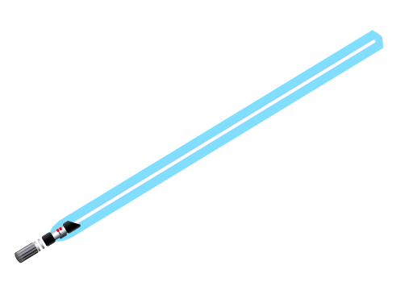

## Hello there  Vitor here!

## About me:
- 😄 Pronouns: He/Him
- ✍ I write about the things I'm learning on this [blog](https://vitorelourenco.wordpress.com/)
- 🧱 Eager to collaborate in open source
- 🚢 I know a lot of stuff about boats
- 👔 Looking for new opportunities

## Languages && Tools

 

  
 :chart: &nbsp;GitHub Stats 

  
  

